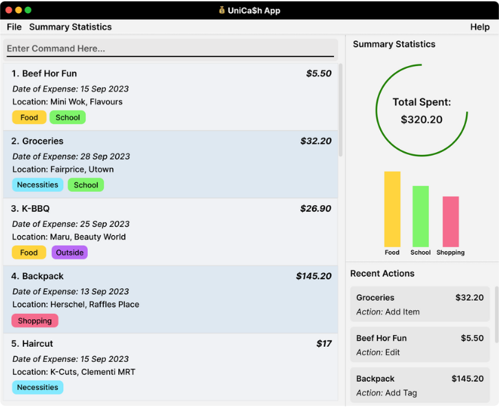

# UniCa$h

## Overview
UniCa$h is a desktop application for university students who want to be more financially conscious. The user interacts with it using a CLI, and it has a GUI created with JavaFX.
UniCa$h is designed for users who are proficient with CLI. It is written in Java 11, spanning about [20 KLoC](https://nus-cs2103-ay2324s1.github.io/tp-dashboard/?search=T16-3&sort=groupTitle&sortWithin=title&timeframe=commit&mergegroup=AY2324S1-CS2103-T16-3%2Ftp%5Bmaster%5D&groupSelect=groupByRepos&breakdown=true&checkedFileTypes=docs~functional-code~test-code&since=2023-09-22&isTabOnMergedGroup=true&tabOpen=true&tabType=authorship&tabAuthor=elhy1999&tabRepo=AY2324S1-CS2103-T16-3%2Ftp%5Bmaster%5D&authorshipIsMergeGroup=true&authorshipFileTypes=docs~functional-code~test-code&authorshipIsBinaryFileTypeChecked=false&authorshipIsIgnoredFilesChecked=false).

Code contributed by me (~7.5KLoC) can be found on my RepoSense dashboard [here](https://nus-cs2103-ay2324s1.github.io/tp-dashboard/?search=T16-3&sort=groupTitle&sortWithin=title&timeframe=commit&mergegroup=&groupSelect=groupByRepos&breakdown=true&checkedFileTypes=docs~functional-code~test-code&since=2023-09-22&tabOpen=true&tabType=authorship&tabAuthor=sp4ce-cowboy&tabRepo=AY2324S1-CS2103-T16-3%2Ftp%5Bmaster%5D&authorshipIsMergeGroup=false&authorshipFileTypes=docs~functional-code~test-code&authorshipIsBinaryFileTypeChecked=false&authorshipIsIgnoredFilesChecked=false). A summary of my contributions are given in my Project Portfolio Page [here](https://sp4ce-cowboy.github.io/tp/team/sp4ce-cowboy.html) which include interactive hyperlinks to specific PRs where each contribution is further elaborated.

This project was completed as part of the course requirement for [CS2103 Software Engineering](https://nusmods.com/courses/CS2103/software-engineering), taken in NUS 
during AY23/24 Semester 1.

## About

User Target Profile: Our application is for university students who want to be more financially conscious about their
spending habits, to enable them to make more economical decisions that provide students on a limited budget with more
purchasing power.

Value Proposition: It provides university students with an intuitive and frictionless experience to have transparency on
their expenditure to help them better understand their spendings so they can develop better financial habits as they
transition into adulthood.

You can find our User Guide [here](https://ay2324s1-cs2103-t16-3.github.io/tp/UserGuide.html), and our Developer Guide [here](https://ay2324s1-cs2103-t16-3.github.io/tp/DeveloperGuide.html)!

## Credits

This project is based on the AddressBook-Level3 project created by the [SE-EDU initiative](https://se-education.org).

## WakaTime

My WakaTime dashboard from Oct 13 [first milestone] to Nov 14 [last milestone]

